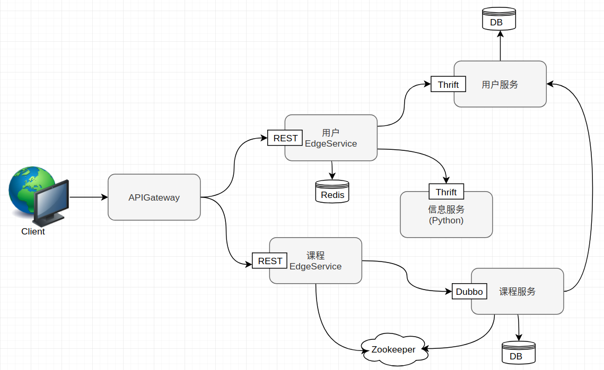
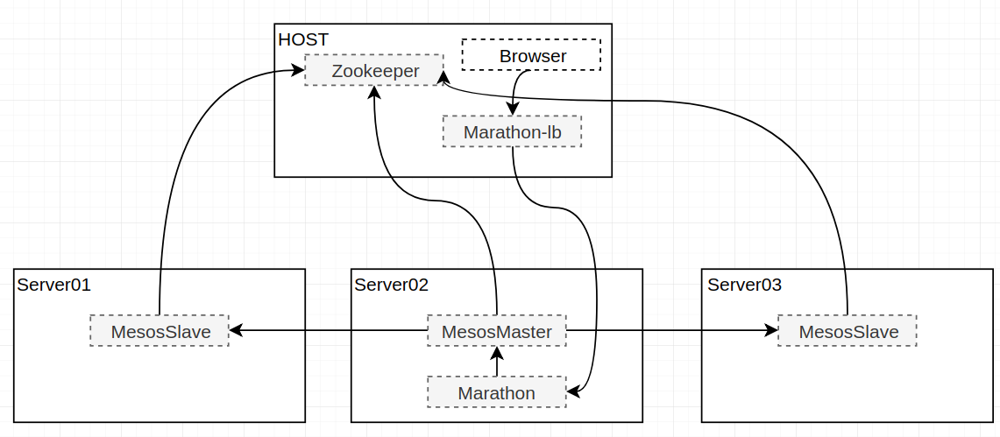

# 模块

## 用户服务

- 用户登录
- 用户注册
- 用户基本信息查询
- 无状态, 无session

## 课程服务
- 登录验证
- 课程的curd

## 信息服务
- 发送邮件
- 发送短信

## 用户edgeservice
## 课程edgeservice
## API GATEWAY

# Docker化
基本镜像
 ```bash
docker pull openjdk:8-jre
docker run -it --entrypoint bash openjdk:8-jre
 ```

把外部服务的配置设为参数
```
spring.datasource.url=jdbc:mysql://${mysql.address}:3307/db_user
```
内部服务则是换成服务名

```
thrift.user.ip=user-service
```


pom中添加插件

```xml
            <plugin>
                <groupId>org.springframework.boot</groupId>
                <artifactId>spring-boot-maven-plugin</artifactId>
                <executions>
                    <execution>
                        <goals>
                            <goal>repackage</goal>
                        </goals>
                    </execution>
                </executions>
            </plugin>
```

然后进行`mvn clean package`．注意此时要先对父pom进行`mvn install`

写Dockerfile

```
FROM openjdk:8-jre
MAINTAINER nnkwrik nnkwrik@gmail.com

COPY target/user-thrift-service-1.0-SNAPSHOT.jar /user-service.jar

ENTRYPOINT ["java","-jar","/user-service.jar"]
```

命令行运行Docker

```
docker build -t user-service:lastest .
docker run -it user-service:latest --mysql.address=192.168.0.5
```

## docker-compose
```bash
docker-compose up -d
docker-compose up -d message-service // 重启某个服务
docker-compose down
```
## 镜像仓库
### 公有仓库

```bash
docker tag zookeeper:3.5  nnkwrik/zookeeper:3.5
docker login
docker push nnkwrik/zookeeper:3.5
docker pull nnkwrik/zookeeper:3.5
```

### 私有仓库

没有交互界面, 多台生产环境时不容易管理
```bash
docker pull registry:2 
docker run -d -p 5000:5000 registry:2 
docker tag zookeeper:3.5 localhost:5000/zookeeper:3.5  
docker push localhost:5000/zookeeper:3.5 
docker pull localhost:5000/zookeeper:3.5
```

### harbor

改harbor.cfg,后 `sudo ./install.sh`
```bash
hostname = hub.nnkwrik.com
```

/etc/hosts中添加

```
127.0.0.1		hub.nnkwrik.com
```

```
docker login hub.nnkwrik.com
docker tag openjdk:8-jre   hub.nnkwrik.co/micro-service/openjdk:8-jre
docker push hub.nnkwrik.com/micro-service/openjdk:8-jre
```

TODO

- Docker-compose化后python的消息服务无法使用

# Mesos



搭建3个vm

```
192.168.0.6		server02
192.168.0.4		server01
192.168.0.7		server03
192.168.0.5		host
```


```
sudo apt-get install docker.io
sudo apt-get install openssh-server
```

### server02(mesos master)

```bash
ubuntu@server02:~$ docker pull mesosphere/mesos-master:1.7.0
sh mesos.sh
```

改hostname , vim /etc/hosts , 127.0.1.1   -->  192.168.0.6     server02

mesos.sh(https://github.com/mesosphere/docker-containers/tree/master/mesos)

```
#!/bin/bash

docker run -d --net=host \
  -e MESOS_PORT=5050 \
  -e MESOS_ZK=zk://192.168.0.5:2181/mesos \
  -e MESOS_QUORUM=1 \
  -e MESOS_REGISTRY=in_memory \
  -e MESOS_LOG_DIR=/var/log/mesos \
  -e MESOS_WORK_DIR=/var/tmp/mesos \
  -v "$(pwd)/log/mesos:/var/log/mesos" \
  -v "$(pwd)/work/mesos:/var/tmp/mesos" \
  mesosphere/mesos-master:1.7.0
  --ip=192.168.0.6 --work_dir=/var/lib/mesos --hostname=192.168.0.6
```

### server01/server03(mesos slave)

```
docker pull mesosphere/mesos-slave:1.7.0
```

同样改hostname , vim /etc/hosts

mesos-slave.sh

```
#!/bin/bash

docker run -d --net=host --privileged \
  -e MESOS_PORT=5051 \
  -e MESOS_MASTER=zk://192.168.0.5:2181/mesos \
  -e MESOS_SWITCH_USER=0 \
  -e MESOS_CONTAINERIZERS=docker,mesos \
  -e MESOS_LOG_DIR=/var/log/mesos \
  -e MESOS_WORK_DIR=/var/tmp/mesos \
  -v "$(pwd)/log/mesos:/var/log/mesos" \
  -v "$(pwd)/work/mesos:/var/tmp/mesos" \
  -v /var/run/docker.sock:/var/run/docker.sock \
  -v /sys:/sys \
  -v /usr/bin/docker:/usr/local/bin/docker \
  mesosphere/mesos-slave:1.7.0 --no-systemd_enable_support
```

### server02(marathon)

```
docker pull mesosphere/marathon:v1.6.549
```

marathon.sh(https://hub.docker.com/r/mesosphere/marathon/)

```bash
#!/bin/bash

docker run -d --net=host \
 mesosphere/marathon:v1.6.549 \
 --master zk://192.168.0.5:2181/mesos \
 --zk zk://192.168.0.5:2181/marathon
```

### host(marathon lb)

```
docker pull mesosphere/marathon-lb:v1.12.3
```

start.sh

```
#!/bin/bash

docker run -d -p 9090:9090 \
 -e PORTS=9090 mesosphere/marathon-lb:v1.12.3 sse \
 --group external \
 --marathon http://192.168.0.6:8080
```

### 部署

marathon,连接方式设为桥接,切换到Port, json mode修改成以下, 切换到Labels `HAPROXY_GROUP=external`

    "portMappings": [
      {
        "containerPort": 9090,
        "protocol": "tcp",
        "servicePort": 10002
      }
此时部署出错,  在slave的/etc/docker/daemon.json添加harbor

```
{
  "insecure-registries" : ["hub.nnkwrik.com"],
  "dns" : ["192.168.0.6"]
}
```

TODO

- 用marathon分配到slave的服务,镜像每过几十秒就会重启, 

## Docker Swarm

搭建3个vm

```
192.168.0.6		server01
192.168.0.4		server02
192.168.0.7		server03
192.168.0.5		host
```

### server01

创建为manager

```bash
root@ubuntu:/home/ubuntu# docker swarm init --advertise-addr 192.168.0.06
Swarm initialized: current node (j3dgiy8ao35641lyxerdwdp21) is now a manager.

To add a worker to this swarm, run the following command:

    docker swarm join \
    --token SWMTKN-1-5x02lj77yb92idsrnzzg9c09ieie8to9yxf0k62gwmw4c19wjy-8m5dxordls6iw4vgpzt6mavj5 \
    192.168.0.06:2377

To add a manager to this swarm, run 'docker swarm join-token manager' and follow the instructions.
```

#### Server02/03,加入swarm

```
    docker swarm join \
    --token SWMTKN-1-5x02lj77yb92idsrnzzg9c09ieie8to9yxf0k62gwmw4c19wjy-8m5dxordls6iw4vgpzt6mavj5 \
    192.168.0.06:2377
```

### 让三个节点是SwarmNode的同时也是SwarmManager

#### Server01

```
docker node ls #确认节点
docker node promote server02	#升级为manager
```

### 创建服务

```bash
docker service create --name test1 alpine ping www.baidu.com
docker service ls	#查看服务
docker service inspect test1	#查看详细信息
```

```bash
docker service create --name nginx nginx
docker service update --publish-add 8080:80 nginx	#暴露端口
#http://192.168.0.6:8080/,http://192.168.0.4:8080/,http://192.168.0.7:8080/ 都可访问
```

### 服务的高可用

```bash
docker service scale nginx=3
docker service ls
docker service ps nginx
```

以上是ingress网络

### 自定义的网络

```bash
docker network create -d overlay imooc-overlay
docker service create --network imooc-overlay --name nginx -p 8080:80 nginx
docker service create --network imooc-overlay --name alpine alpine ping www.baidu.com
docker service ls
```

自定义就能从alpine容器中`ping nginx`.ingress则不行,(mode = vip)

此时,不仅能在外部通过ip访问,也能在服务间用服务名访问

### dnsrr

只需要通过名字在容器间访问时使用. 外部无法访问

```bash
docker service create --name nginx-b --endpoint-mode dnsrr nginx
docker service update --network-add imooc-overlay nginx-b
```

```bash
docker service ls
docker service rm d8ufvhgsyb8g eln k7p #删掉目前的服务
```

### stack

定义一个组,设置相互依赖的关系, 类似于compose

server01, service.yml

```yaml
version: "3.4"
services:
  alpine:
    image: alpine
    command:
      - "ping"
      - "www.baidu.com"
    networks:
      - "imooc-overlay"
    deploy:
    # endpoint_mode: dnsrr
      replicas: 2
      restart_policy:
        condition: on-failure
      resources:
        limits:
          cpus: "0.1"
          memory: 50M
    depends_on:
      - nginx

  nginx:
    image: nginx
    networks:
        - "imooc-overlay"
    ports:
        - "8080:80"

networks:
  imooc-overlay:
    external: true
```

```bash
docker stack deploy -c service.yml test
docker stack ls	#确认
docker stack services test
docker service ls
```

### swarm微服务部署

server01,创建swarm-service.yml

```
docker stack deploy -c swarm-service.yml ms
```

### 负载均衡

让他能均衡访问三个vm中的api-gateway

```bash
#server01
docker pull nginx
docker run -idt -p 80:80 -v `pwd`/nginx.conf:/etc/nginx/conf.d/default.conf nginx
```

nginx.conf

```
upstream nnkwrik{
    server 192.168.0.06:8080;
    server 192.168.0.04:8080;
    server 192.168.0.07:8080;
}

server {
    listen       80;
    server_name  www.nnkwrik.com;

    #charset koi8-r;
    #access_log  /var/log/nginx/host.access.log  main;

    location / {
        proxy_pass http://nnkwrik;
    }

    #error_page  404              /404.html;

    # redirect server error pages to the static page /50x.html
    #
    error_page   500 502 503 504  /50x.html;
    location = /50x.html {
        root   /usr/share/nginx/html;
    }
}
```

在host设置域名`192.168.0.6     www.nnkwrik.com`后,可从浏览器通过域名访问

TODO

- 能访问, 密码验证成功后不返回,导致Read timed out